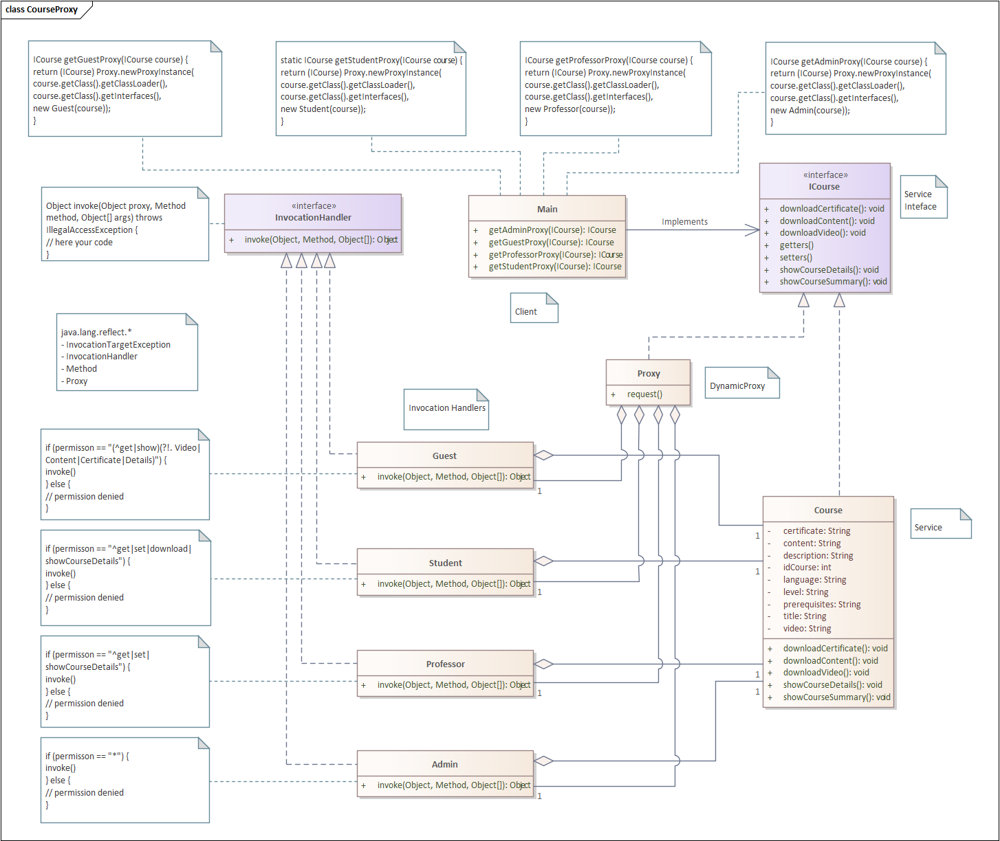

# Proxy

## Descripción

Imagina que trabajas como desarrollador en una empresa que ofrece cursos en línea.

La empresa te ha solicitado crear las funciones necesarias para los cursos en línea.

## Funcionalidades

* Creación, eliminación y edición de cursos
* Acceso resumida y detallada de los cursos
* Descarga de los archivos de los cursos

## Problema

La empresa necesita que los cursos sean accesibles sólo para ciertos usuarios.

Para ello, se necesita implementar un sistema de autenticación.

* Un usuario invitado puede ver la lista resumida de cursos, pero no puede acceder a los detalles ni descargar los archivos.
* Un estudiante puede ver la lista de cursos, acceder a los detalles y descargar los archivos.
* Un profesor puede crear, editar y eliminar cursos, además de acceder a los detalles.
* Un administrador puede hacer todo lo anterior.

## Solución

Se necesita implementar un sistema de autenticación que permita a los usuarios acceder a las funcionalidades de acuerdo a su rol.

Para ello, se necesita implementar un patrón Proxy que permita controlar el acceso a los cursos.

## Diagrama de clases

## Diagrama de secuencia

## Conclusión

El patrón Proxy es una solución efectiva para controlar el acceso que tienen los usuarios (clientes) a los cursos en línea (objetos).

## Referencias

* https://refactoring.guru/design-patterns/proxy
* https://www.geeksforgeeks.org/proxy-design-pattern/
* https://sourcemaking.com/design_patterns

* Gamma, E., Helm, R., Johnson, R., & Vlissides, J. (1995). Design patterns: Elements of Reusable Object-Oriented Software. Pearson Deutschland GmbH.
* Freeman, E., Robson, E., Freeman, E., Sierra, K., & Bates, B. (2004). Head first design patterns. «O'Reilly Media, Inc.».
